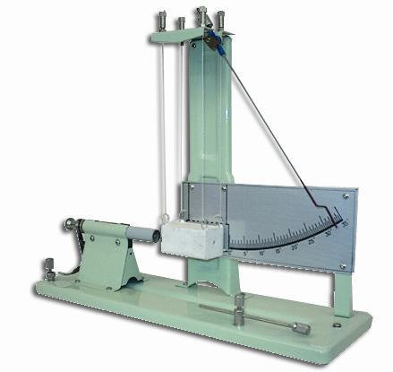

## Theory 

### What is a Ballistic pendulum?

A ballistic pendulum is a device for measuring a bullet's momentum, from which it is possible to calculate the velocity and kinetic energy. Ballistic pendulums have been largely rendered obsolete by modern chronographs, which allow direct measurement of the projectile velocity. It can be used to measure any transfer of momentum. For example, a ballistic pendulum was used by physicist C. V. Boys to measure the elasticity of golf balls and by physicist Peter Guthrie Tait to measure the effect that spin had on the distance a golf ball traveled.

  

 

In a perfectly inelastic collision, a bullet is fired into the stationary pendulum, which captures the bullet and absorbs its energy. The stationary pendulum now moves with a new velocity just after the collision. While not all of the energy from the bullet is transformed into kinetic energy for the pendulum (some is used as heat and deformation energy) , the momentum of the system is conserved. By measuring the height of the pendulum's swing, the potential energy of the pendulum when it stops can be measured. In the case of a pendulum total mechanical energy is conserved. So kinetic energy of the pendulum (after firing) is fully converted to potential energy. Thus the pendulum's initial velocity can be calculated.Using the law of conservation of momentum, the velocity of the bullet can be computed.

From the law of conservation of mechanical energy of the pendulum;

$$\frac{1}{2}(m+M)V^{2}=(m+M)gh$$

where,

m-  Mass of bullet 
M-   Mass of Pendulum 
h-    Maximum height reached by the pendulum 
v-    Velocity of the bullet 
V- Velocity of pendulum 
g-Gravity of earth 

According to the law of conservation of momentum;

$$mv=(M+m)V$$

$$mv=(M+m)\sqrt{2gh}$$

Velocity of the bullet is given by;

$$v=\frac{1}{m}(M+m)\sqrt{2gh}$$

$$v=(\frac{M}{m}+1)\sqrt{2gh}$$

### Applications:
- This is one way to measure the speed of a bullet.
- We can verify the law of conservation of momentum.
